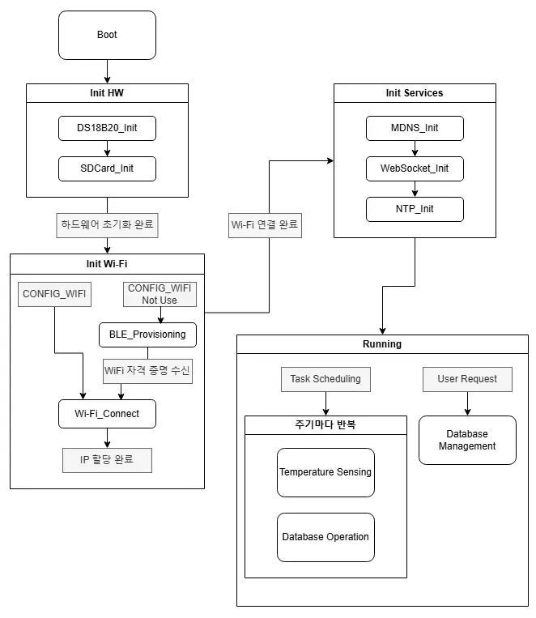
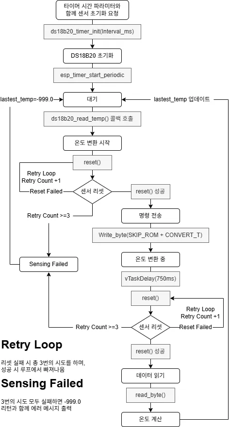
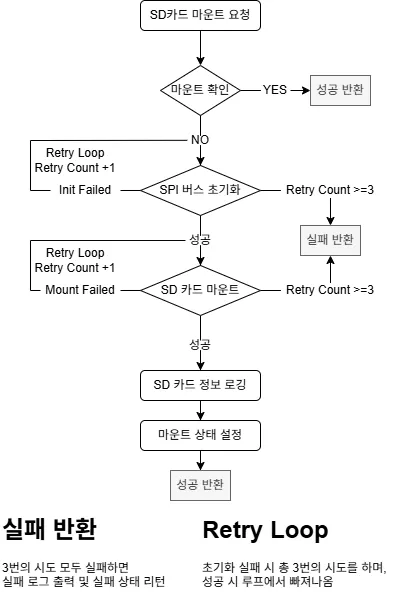
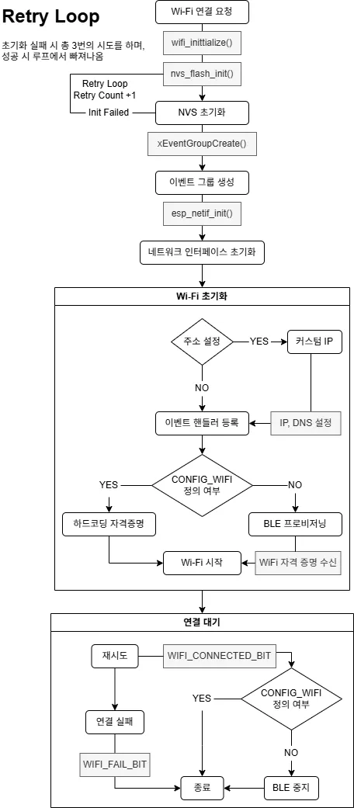
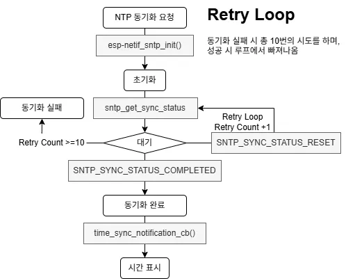
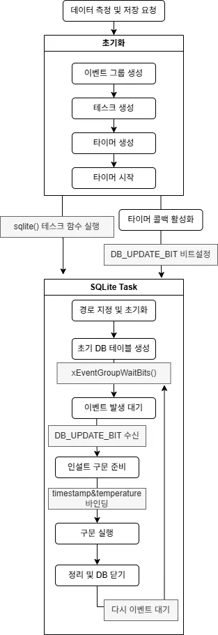
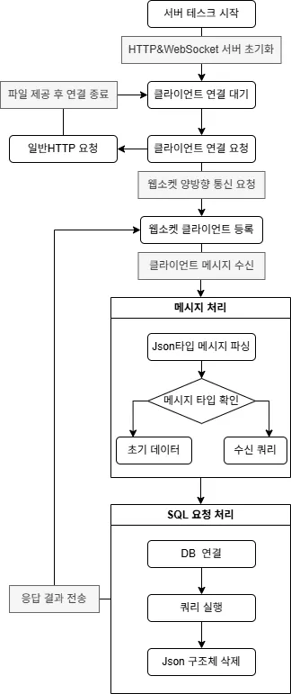

# SEMS-ESP 프로젝트

## 목차
### 프로젝트 개요
1. [소개](#소개)
2. [주요 기능](#주요-기능)
3. [프로젝트 구조](#프로젝트-구조)
4. [네트워크 설정](#네트워크-설정)
5. [하드웨어 요구사항](#하드웨어-요구사항)
6. [핀연결](#핀-연결)
7. [기술 스택](#기술-스택)
8. [설치 및 과정](#설치-및-과정)
9. [사용 방법](#사용-방법)
10. [라이선스](#라이선스)
### 프로젝트 설계
1. [프로젝트 구조도](#프로젝트-구조도)
2. [DS18B20센서 실시간 온도 측정 프로세스](#DS18B20센서-실시간-온도-측정-프로세스)
3. [SD카드 SPI 방식 마운트 프로세스](#SD카드-SPI-방식-마운트-프로세스)
4. [BLE 프로비저닝을 통한 와이파이 연결 프로세스](#BLE-프로비저닝을-통한-와이파이-연결-프로세스)
5. [NTP를 이용한 날짜/시간 동기화 프로세스](#NTP를-이용한-날짜/시간-동기화-프로세스)
6. [실시간 데이터 측정 및 저장 프로세스](#실시간-데이터-측정-및-저장-프로세스)
7. [웹 소켓을 이용한 DB 관리 프로세스](#웹-소켓을-이용한-DB-관리-프로세스)
### 트러블 슈팅
1. [리소스가 제한된 임베디드 장치에서의 메모리 초과 문제](#리소스가-제한된-임베디드-장치에서의-메모리-초과-문제)
2. [SQLite의 동시 접근 제한으로 인한 트랜잭션 오류](#SQLite의-동시-접근-제한으로-인한-트랜잭션-오류)

## 소개
SEMS-ESP 프로젝트는 ESP32 보드를 사용하여 주기적으로 온도를 측정하고, SQLite 데이터베이스에 저장한 후 SD 카드에 기록하는 시스템입니다.  
블루투스를 통해 wifi정보를 전송하여 wifi를 자동 연결 합니다.  
또한, Wi-Fi를 통해 보드에 내장된 웹사이트에 접속하여 데이터베이스를 제어할 수 있습니다.  
이 프로젝트는 IoT 및 데이터 로깅 애플리케이션에 적합합니다.

## 주요 기능
- **온도 측정**: DS18B20 센서를 사용하여 주기적으로 온도를 측정합니다.
- **데이터베이스 저장**: 측정된 온도를 SQLite 데이터베이스에 저장합니다.
- **SD 카드 기록**: SD카드 어댑터를 사용하여 데이터베이스 파일을 마운트된 SD 카드에 저장합니다.
- **BLE 프로비저닝**: 블루투스를 통해 초기 Wi-Fi 설정이 가능합니다.(BLE 프로비저닝을 비활성화하고 직접 Wi-Fi 정보를 입력할 수 있습니다.)
- **웹 인터페이스**: Wi-Fi를 통해 ESP32 보드에 내장된 웹사이트에 접속하여 데이터베이스를 제어할 수 있습니다.
- **자동 네트워크 구성**: 고정 IP(192.168.0.3) 및 mDNS(sems.local) 지원으로 쉽게 접속할 수 있습니다.
- **NTP 시간 동기화**: NTP 서버를 통해 시간 동기화가 가능합니다.
- **커스텀 IP 설정**: 필요에 따라 커스텀 IP 설정이 가능합니다.
- **설정 통합 관리**: common/sems_def.h 파일을 통해 주요 설정들을 빠르게 관리할 수 있습니다.

## 프로젝트 구조
```
SEMS-ESP/
├── main/
│   ├── CMakeLists.txt
│   ├── main/idf_component.yml
│   ├── main/main.c
├── user_components/
│   ├── ble_prov/
│   ├── common/
│   ├── ds18b20/
│   ├── ntp/
│   ├── sdcard/
│   ├── sqlite/
│   └── websocket/
├── CMakeLists.txt
├── dependencies.lock
├── partitions.csv
└── sdkconfig
└── sdkconfig.ci
└── sdkconfig.defaults
```

## 네트워크 설정
1. **초기 설정**: 
   - 블루투스를 통한 Wi-Fi 프로비저닝
   - 디바이스 이름: "ESP_WIFI_PROV"로 검색 가능
   
2. **접속 방법**:
   - 고정 IP: `192.168.0.3`
   - mDNS 주소: `sems.local`

3. **보안**:
   - BLE 연결 시 보안 페어링 필요
   - Wi-Fi 자격증명은 암호화되어 전송

## 하드웨어 요구사항
1. ESP32-S3 보드 혹은 코드가 호환되는 보드
    > ESP32-S3-DevKitC-1-N32R8V보드를 기준으로 작성되었습니다.  
    sdkconfig.defaults와 partitions를 사용 보드에 맞게 수정해주세요.
2. DS18B20 온도 센서
3. SD 카드 모듈(SPI 방식)
4. 기타 연결용 점퍼 와이어

## 핀 연결
- DS18B20 : GPIO_NUM_4
- SD카드 모듈 :
    - MOSI : GPIO_NUM_11
    - MISO : GPIO_NUM_13
    - SCK : GPIO_NUM_12
    - CS : GPIO_NUM_10

## 기술 스택
- **프레임워크**: ESP-IDF v5.0+
- **데이터베이스**: SQLite3
- **통신 프로토콜**: 
  - BLE (프로비저닝)
  - Wi-Fi (웹 인터페이스)
  - WebSocket (실시간 데이터 통신)
- **파일 시스템**: FATFS (SD 카드 SPI방식)


## 설치 및 설정
1. **ESP-IDF 설치**: ESP32 개발을 위해 [ESP-IDF](https://github.com/espressif/esp-idf)를 설치합니다.
2. **프로젝트 클론**: 이 저장소를 클론합니다.
   ```
   git clone https://github.com/JinhyeokKo/sems-esp.git
   cd sems-esp
    ```
3. 종속성 설치: 필요한 종속성을 설치합니다.
    ```
    idf.py install
    ```
4. 빌드 및 플래시: 프로젝트를 빌드하고 ESP32 보드에 플래시합니다.
    ```
    idf.py build
    idf.py flash
    ```

## 사용 방법
> 사용 전 sdkconfig.defaults 설정을 본인의 보드에 맞게 설정해주세요
1. 블루투스로 'ESP_WIFI_PROV'와 페어링(보드 자동 연결 허용)
2. 페어링 후 wifi 정보(SSID, PASSWORD) 전송
    > uuid가 존재하는 custom service로 write모드로 전송  
    형식 : ssid,pw

3. 웹 브라우저에서 `http://192.168.0.14` 또는 `http://sems.local` 접속하여 db 조회 및 제어

## 라이선스
이 프로젝트는 MIT 라이선스 하에 배포됩니다. 자세한 내용은 LICENSE 파일을 참조하세요.

### 외부 라이브러리 라이선스
이 프로젝트는 다음 외부 라이브러리를 사용하며, 각 라이브러리는 해당 라이선스에 따라 배포됩니다:
- [esp32-idf-sqlite3](https://github.com/nopnop2002/esp32-idf-sqlite3) : Apache 2.0 라이선스
- ESP-IDF 라이브러리 : Apache 2.0 라이선스
- [ESP32 WebSocket](https://github.com/Molorius/esp32-websocket) : GPL-3.0 라이선스스

각 외부 라이브러리의 라이선스 조건을 준수해야 합니다. 자세한 내용은 각 라이브러리의 라이선스 파일을 참조하세요.

## 프로젝트 설계
### 프로젝트 구조도



### DS18B20센서 실시간 온도 측정 프로세스
#### 1-Wire 프로토콜 이용
- 리셋 펄스 : 마스터에서 480μs 동안 로우(0) 신호 전송 후 센서의 존재 펄스 감지
- 시간 슬롯 : 각 비트 전송은 60-120μs 시간 슬롯 내에서 이루어짐
- 쓰기 작업 : 특정 시간 패턴(1-5μs 로우, 60μs 대기)으로 GPIO 상태 제어
- 읽기 작업 : 마스터에서 2-10μs 동안 로우 신호 전송 후 센서 응답 감지

#### 명령 체계
- Skip ROM (0xCC) : 주소 지정 생략, 단일 센서 환경에 최적화
- Convert T (0x44) : 온도 변환 시작 명령
- Read Scratchpad (0xBE) : 센서 메모리에서 온도 데이터 읽기

#### 소프트웨어 아키텍처
- LSB 우선 전송 방식 채택
- ESP32의 고해상도 타이머 API 활용(설정한 간격으로 온도 측정 자동화)
- FreeRTOS 테스크 지연 함수를 활용한 온도 변환 대기 시간 관리
- 센서 불응 상태에 대한 오류 로깅 및 특수 값(-999.0)을 통한 상태 표시
- 최대 3회의 통신 재시도 매커니즘 구현



### SD카드 SPI 방식 마운트 프로세스
#### 프로토콜 스택
- 최하위 계층 : SPI 버스 드라이버 (spi_bus_initialize)
- 중간 계층 : SD/MMC 카드 프로토콜 구현 (esp_vfs_fat_sdspi_mount)
- 상위 계층 : FAT 파일 시스템 (esp_vfs_fat)

#### 주요 구성 매개변수
- 버스 구성 : 최대 4000byte 전송 가능, SDSPI_DEFAULT_DMA 모드
- 마운트 구성 : 최대 동시 5개 파일 개방 가능, 할당 단위 크기 16KB

#### 소프트웨어 아키텍처
- 제한된 파일 핸들(5개)로 메모리 사용 최적화
- 타임아웃 오류 발생 시 500ms 대기 후 재시도
- 하드웨어 초기화 오류 발생 시 풀업 저항 점검 안내 및 리소스 해제
- 단계별 재시도 매커니즘으로 일시적 하드웨어 오류를 극복하여 안정성 향상
- 초기화 실패시 SPI 버스 리소스 자동 해제로 리소스 관리



### BLE 프로비저닝을 통한 와이파이 연결 프로세스
#### 네트워크 구성 방식
- 동적 구성 : DHCP 클라이언트를 통한 자동 IP 할당
- 정적 구성 : 컴파일 타임 매크로 CUSTOM_IP를 통한 사전 정의된 네트워크 파라미터 적용 (IP 주소, 게이트웨이, 서브넷 마스크, DNS 서버 정적 구성)

#### 서비스 탐색 매커니즘
- mDNS(Multicast DNS) 프로토콜을 구현하여 로컬 네트워크 내에서 장치의 자동 탐색 기능을 제공
- HTTP 서비스는 포트 80을 통해 노출되며, _http._tcp 서비스 타입으로 등록

#### 소프트웨어 아키텍처
- NVS 파티션 관리를 통해 자격 증명 정보의 지속적 저장을 보장하며, 파티션 가용 공간 부족 시 자동 초기화 로직을 구현하여 시스템 안정성 확보
- BLE 프로비저닝 완료 후 Wi-Fi 연결 성공 시 BLE 서비스를 자동 종료하여 전력 소모 최소화
- FreeRTOS 이벤트 그룹을 활용한 상태관리시스템(레지스터 비트 활용)을 통해 연결 상태를 실시간 모니터링하며, 네트워크 단절 시 자동 복구



### NTP를 이용한 날짜/시간 동기화 프로세스
#### 프로토콜 스택
- RFC 5905 기반 NTP 프로토콜 적용
- ESP-IDF SNTP 컴포넌트 라이브러리 활용
- UDP 기반 비동기 통신

#### 성능 및 특징
- 밀리초 단위의 시간 정확도 제공
- 동기화 완료 후 SNTP 클라이언트 대기 모드 전환으로 전력 소모 최소화
- 동기화 대기 상태로 진입(최대10회)하여 안정적인 동기화 가능
- 현재 시간을 파라미터로 넘겨받은 버퍼에 "YYYY-MM-DD HH:MM:SS" 형식으로 시간 정보를 저장하는 유틸리티 함수 별도 구현

#### 소프트웨어 아키텍처
- POSIX 표준 TZ DB를 활용하여 표준 시간대 관리
- TZ 환경 변수 설정을 통해 KST-9 시간으로 설정
- NTP 서버로 “time.windows.com” 활용
- 콜백 함수를 만들어 이를 통한 동기화 알림 및 이벤트 처리
- sntp_sync_status_t 구조체를 이용하여 동기화 상태 확인



### 실시간 데이터 측정 및 저장 프로세스
#### 초기 설정
- SD 카드 마운트 포인트 획득 후 DB 경로 설정
- SQLite 라이브러리 초기화
- WAL 저널링 모드 활성화로 데이터 무결성 및 동시성 향상
- 데이터 저장을 위한 테이블 생성

#### 데이터 수집 및 저장 매커니즘
- ESP 타이머 인터럽트를 통해 주기적으로 데이터 수집 및 저장
- 수집한 온도정보를 더블바인딩하여 SQL 쿼리에 값을 추가
- 타임 스탬프 기반 데이터 저장으로 시계열 분석이 가능

#### 멀티태스킹 및 리소스 관리
- 전용 SQLite 테스크를 6kb의 스택 크기를 할당하여 동작
- 이벤트 그룹을 활용하여 테스크간 동기화
- DB 작업 완료 후 더블바인딩 옵션 종료와 DB 닫기로 리소스 관리

#### 오류 처리 매커니즘
- Sqlite3_errmsg(db) 함수로 상세 오류 로깅
- SQL 쿼리 준비 및 실행 단계별 반환 코드 검증
- 오류 발생 시  할당된 리소스의 단계별 해제



### 웹 소켓을 이용한 DB 관리 프로세스
#### SQLite DB 통합
- 임베디드 환경에 최적화된 SQLite를 통해 제한된 리소스에서도 관계형 데이터베이스 기능 제공
- SQL 실행 시 sql 처리 함수와 콜백 매커니즘을 결합하여 쿼리 결과를 웹 소켓 프레임으로 직접 스트리밍하여 메모리 오버헤드 최소화
- 구분자를 활용한 데이터 직렬화를 통해 프로토콜 오버헤드 감소 

#### 통신 프로토콜 최적화
- 요청 메시지 : {"id":"command-type", "data":"command-data"}
- 주요 명령 : init(초기값), text(SQL 쿼리)
- 응답 메시지 : REPLY\x04[결과 데이터] (ASCII 0x04 문자를 필드 구분자로 사용하여 프로토콜 효율성 향상)

#### 아키텍처 및 프로토콜
- RFC 5466 표준 웹 소켓 프로토콜을 사용하여 실시간 양방향 통신 구현
- 웹 소켓 텍스트 타입 프레임을 활용하여 JSON 구조화 데이터 교환 구현
- TCP/IP 기반 위에 HTTP Upgrade 메커니즘을 통한 웹 소켓 핸드 셰이크 과정을 거쳐 연결



## 문제 해결
### 리소스가 제한된 임베디드 장치에서의 메모리 초과 문제
#### 문제
제한된 메모리 환경에서 BLE, 센서, SQLite DB 등의 기능을 동시에 사용하면 메모리 부족으로 인해 시스템이 불안정해지는 문제가 발생했습니다.
#### 해결 방법
1. Wi-Fi 자격 증명을 BLE를 통해 입력받은 후, Wi-Fi 연결이 완료되면 BLE 기능을 즉시 종료하여 메모리 점유를 최소화했습니다.
2. 환경 정보를 측정할 때만 센서를 활성화하고, 측정이 끝나면 센서를 비활성화하여 불필요한 메모리 사용과 전력 소비를 줄였습니다.
3. SQLite DB에 데이터를 저장할 때만 DB 기능을 활성화하고, 저장이 완료되면 즉시 종료하도록 구현하여 메모리 낭비를 방지했습니다.
#### 결과
필요한 기능만 순간적으로 활성화하고 사용 후 종료하는 방식으로 메모리 사용량을 최적화하여, 제한된 환경에서도 원활한 시스템 동작을 유지할 수 있었습니다.

```C
// filepath: /user_components/websocket/web.c
void wifi_init_sta(void) {
#ifndef CONFIG_WIFI
    ESP_ERROR_CHECK(ble_prov_init());
    ESP_ERROR_CHECK(ble_prov_start());

    wifi_credentials_t credentials;
    ESP_ERROR_CHECK(ble_prov_get_credentials(&credentials));
…
}
static void event_handler(void *arg, esp_event_base_t event_base, int32_t event_id, void *event_data) {
…
ESP_ERROR_CHECK(ble_prov_stop());
}
```

### SQLite의 동시 접근 제한으로 인한 트랜잭션 오류
#### 문제
여러 개의 테스크가 동시에 SQLite DB에 접근할 경우 트랜잭션 충돌이 발생하여 데이터 저장이 실패하는 문제가 발생했습니다.
#### 해결 방법
1. SQLite의 WAL(Write-Ahead Logging) 모드를 활성화하여 트랜잭션 충돌을 방지하고, 성능을 개선했습니다.
2. DB 접근이 필요한 테스크의 우선순위를 동일하게 두고 작업이 완료되면 테스크를 종료하도록 하여 연속된 작업을 진행하더라도 완료 즉시 다음 테스크를 작업하도록 하였습니다.
#### 결과
저널링 기능을 활용해 트랜잭션 처리 방식을 개선하고, 동시 접근을 관리하여 데이터 손실 없이 안정적인 DB 운영이 가능해졌습니다.

```C
// filepath: /main/main.c
void sqlite(void *pvParameter) {
…
rc = db_exec(db, "PRAGMA journal_mode=WAL;");
…
}
void app_main(void){
…
xTaskCreate(&sqlite, "SQLITE3", 1024 * 6, NULL, 5, NULL);
}
// filepath: /user_components/websocket/web.c
void websocket_init(void) {
...
xTaskCreate(&client_task, "client_task", 1024 * 6,
                (void *)get_mount_point(), 5, NULL);
}
```
